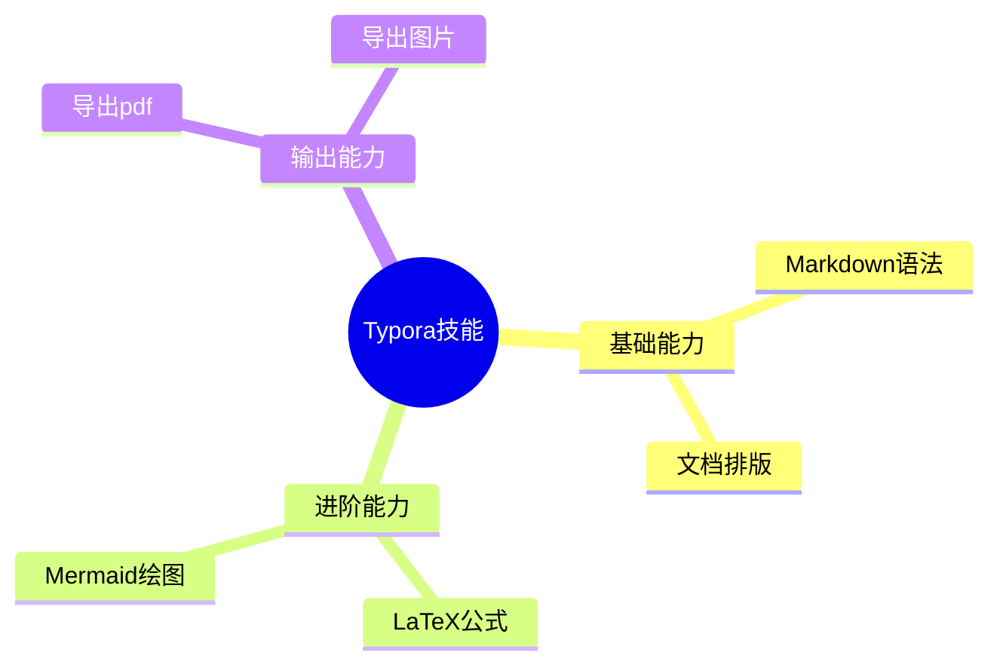
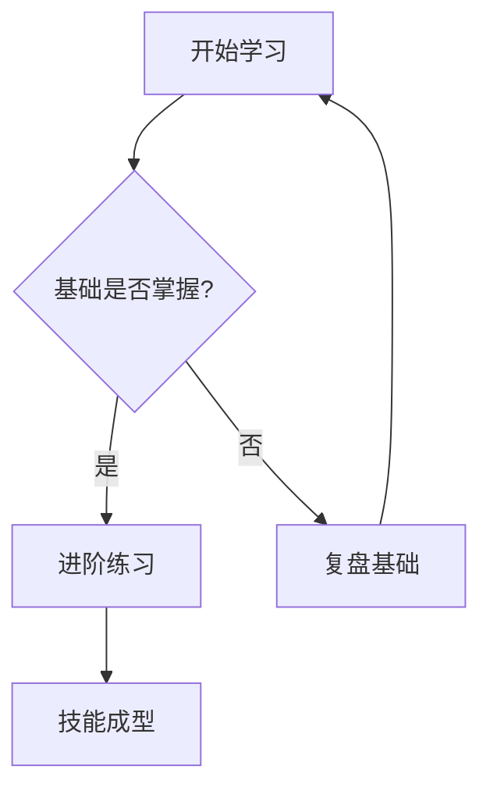
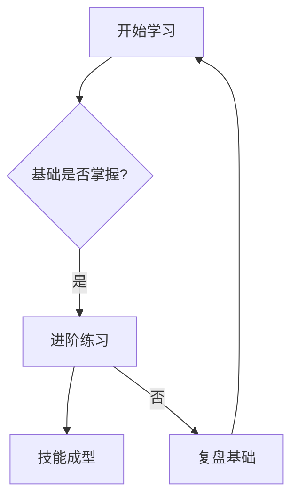
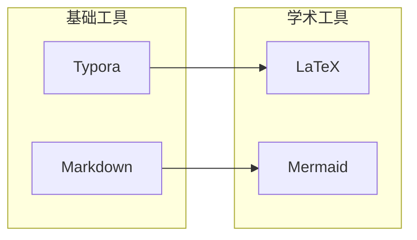
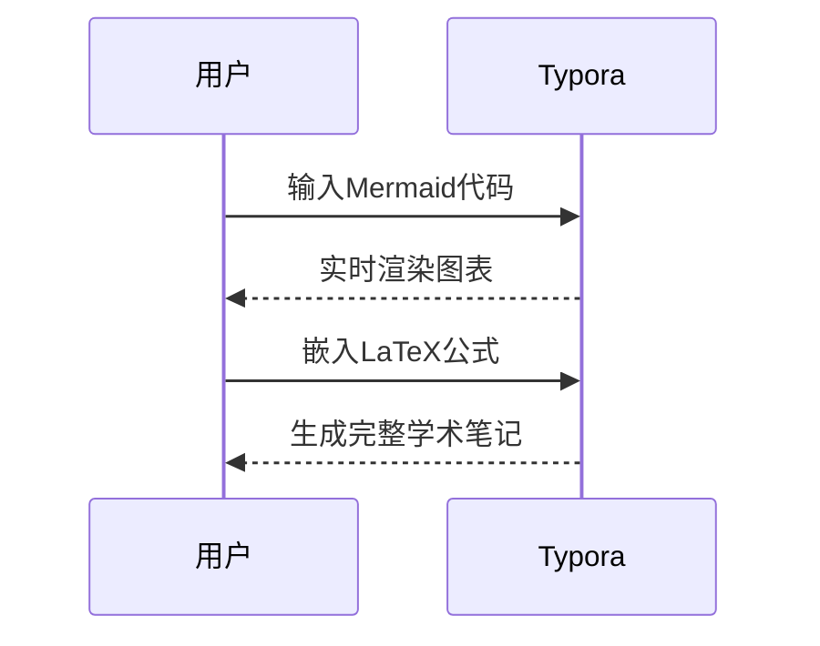
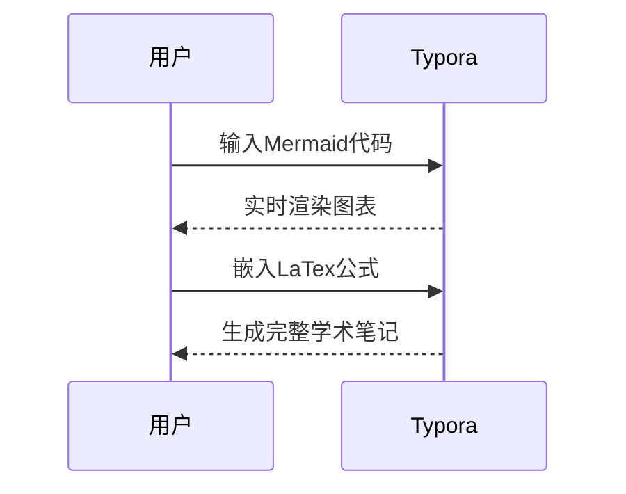
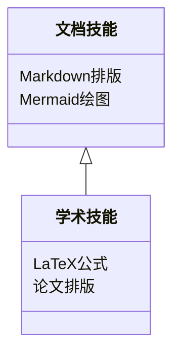

# Markdown常用语法

[toc]


## 一、标题

```markdown
# 一级标题

## 二级标题

### 三级标题

#### 四级标题

###### 五级标题

####### 六级标题
```

示例效果：

> # 一级标题
>
> ## 二级标题
>
> ### 三级标题
>
> #### 四级标题
>
> ##### 五级标题
>
> ###### 六级标题


## 二、文本样式


```markdown
**加粗文字**
*斜体文字*
***加粗斜体***
~~删除线~~
==高亮标记== <!--Typora拓展语法支持 -->
```

示例：

**加粗文字**

斜体文字*

***加粗斜体***

~~删除线~~

==高亮标记==


## 三、上下标（扩展）

```markdown
H~2~O  下标
x^3^    上标
```

示例：

H~2~O

x^3^


## 四、换行与分段

- 分段：空一行
- 强制换行：行末尾加`两个空格`或`<br>`


## 五、转义字符

在特殊符号前加**反斜杠`\`**,取消解析、原样显示

```markdown
\# \* \- \> \` \[ \] \( \) \_ \~
```

示例：

\#  \*  \-  \>  \`  \[   \(   \_  \~

可转义所有Markdown特殊符号


## 六、列表语法

### 1.无序列表

支持`-`/`+`/`*`三种符号，当两个或多个列表挨得很近时，可以各个列表交替使用不同的符号

```markdown
   - 项目一
   - 项目二
   - 项目三
   
   + 项目一
   + 项目二
   + 项目三
   
   * 项目一
   * 项目二
   * 项目三
   
   - 项目一
   - 项目二
   - 项目三
   + 新项目一
   + 新项目二
   * 新新项目一
```

示例：

   - 项目一
   - 项目二
   - 项目三

   

   + 项目一
   + 项目二

   - 新项目一
   - 新项目二

### 2.有序列表

```markdown
   1. 第一项
   2. 第二项
   3. 第三项
```

示例：

      1. 第一项
      2. 第二项
      3. 第三项

### 3.嵌套列表

缩进（2空格/4空格/...）实现嵌套，推荐直接tab

```markdown
- 一级列表
  - 二级嵌套
  	- 三级嵌套

1. 有序一级
  1. 有序二级
```

示例：

- 一级列表
  -   二级嵌套
    - 三级嵌套


1. 有序一级
   1. 有序二级


## 七.任务清单

```markdown
- [ ] 未完成任务
- [x] 已完成任务
```

示例：

- [ ] 未完成任务
- [x] 已完成任务


## 八.引用&块引用

### 1.基础引用

```markdown
> 单行引用
> 多行引用自动接续
```

示例：

单行引用：

> 勾股定理 $a^2+b^2=c^2$

多行引用：

> 《静夜思》作于唐玄宗开元十四年（726年），时年二十六岁的李白身处扬州（今属江苏）的旅舍中。是年春，李白踏上前往扬州的旅程，入秋后却不幸染病，只能卧于旅舍。旧历九月十五日左右的夜晚，天空中月明星稀，李白抬头，望见一轮皓月高悬，在这静谧的氛围中，漂泊他乡的孤寂与对故乡的思念之情如潮水般涌上心头，促使他写下了这首流传千古、中外闻名的《静夜思》。据考证，与之同期同地创作的诗篇，还有《秋夕旅怀》。

### 2.引用内混合语法

引用内可嵌套加粗、列表、链接等所有语法

### 3.Admonitions（提示块）

**核心语法模板**

```markdown
> [!类型]
> 这里写提示内容，支持多行、Markdown格式（比如`代码高亮`、**加粗**、列表等）
```

**NOTE 普通提示**

```markdown
> [!NOTE]
> In theory, NanaZip Classic can run on Windows 10 (Build 10240) or later if `ucrtbase.dll` in the `System32` folder has been replaced with version 10.0.19041.0 or later. However, this is a high-risk operation and is not recommended.
```

示例：

> [!NOTE]
>
> In theory, NanaZip Classic can run on Windows 10 (Build 10240) or later if `ucrtbase.dll` in the `System32` folder has been replaced with version 10.0.19041.0 or later. However, this is a high-risk operation and is not recommended.


**TIP 技巧建议**

```markdown
> [!TIP]
> 写 README 推荐多用提示块，层次清晰、可读性更强。
```

示例：

> [!TIP]
>
> 写 README 推荐多用提示块，层次清晰、可读性更强。


**IMPORTANT 重要信息**

```markdown
> [!IMPORTANT]
> 环境版本必须 ≥ Python 3.9，低版本无法兼容依赖库。
```

示例：

> [!IMPORTANT]
>
> 环境版本必须 ≥ Python 3.9，低版本无法兼容依赖库。


**WARNING 警告提醒**

```markdown
> [!WARNING]
> 测试环境请勿接入公网，避免安全漏洞被利用。
```

示例：

> [!WARNING]
>
> 测试环境请勿接入公网，避免安全漏洞被利用。


**CAUTION 高危禁止**

```markdown
> [!CAUTION]
> NanaZip can be used as portable version if you use the official portable release package. It's designed for debugging/testing/development purpose and scenarios (a.k.a. Server Core, Windows PE, Windows RE, and Wine) really need portable version. But please note that some features is not available, such as context menu and file associations. Some issues will not be fixed if you are using NanaZip in portable mode.
```

示例：

> [!CAUTION] 
>
> NanaZip can be used as portable version if you use the official portable release package. It's designed for debugging/testing/development purpose and scenarios (a.k.a. Server Core, Windows PE, Windows RE, and Wine) really need portable version. But please note that some features is not available, such as context menu and file associations. Some issues will not be fixed if you are using NanaZip in portable mode.


|  类型语法   | 主题色调 | 图标 |       适用场景       |
| :---------: | :------: | :--: | :------------------: |
|   `NOTE`    |   蓝色   |  ℹ️   |  普通说明、补充备注  |
|    `TIP`    |   绿色   |  💡   | 技巧、建议、最佳实践 |
| `IMPORTANT` |   紫色   |  ❗   |  关键信息、必看规则  |
|  `WARNING`  |   黄色   |  ⚠️   |  风险提醒、注意事项  |
|  `CAUTION`  |   红色   |  🚫   |  高危操作、禁止行为  |


## 九、分割线

三种写法等效，必须单独成行

```markdown
---
***
___
```

示例：

---

***

___


## 十、代码语法

### 1.行内代码

单个反引号包裹，短代码或关键字专用

```markdown
使用`print()`函数、变量`name`
```

示例：

使用`print()`函数、变量`name`

### 2.块级代码块（栅栏语法）

**成对三个反引号**，首尾单独成行，可指定语言，内部完全不渲染

````markdown
```markdown
# 这里所有符号原样显示
**加粗不会生效**
- 列表不会解析
```

```python
#指定编程语言，开启语法高亮
a = 10
print(a)
```
````

支持语言：`markdown`/`python`/`java`/`js`/`cpp`/`sql`

示例：

```markdown
# 这里所有符号原样显示
**加粗不会生效**
- 列表不会解析
```

```python
#指定编程语言，开启语法高亮
a = 10
print(a)
```

### 3.缩进代码块（旧式）

行首4个空格缩进，整块识别为代码


## 十一、链接与图片

### 1.行内超链接

```markdown
[链接显示文本](https://www.example.com "可选标题")
```

可选标题的作用是鼠标悬停在超链接上时会显示你写的可选标题

示例：

[百度官网](https://www.baidu.com "百度")

### 2.引用式链接

长文档整洁用

```markdown
[百度][baidu] [QQ][qq]
[baidu]: https://www.qq.com
[qq]: https://im.qq.com
```

示例：

[百度][baidu]  [QQ][qq]

[baidu]: https://www.baidu.com	"title(optional)"
[qq]: https://im.qq.com	"title(optional)"

### 3.图片

比链接多一个感叹号`!`，可选标题的作用是鼠标悬停在图片上时会显示你写的可选标题，图片描述用于图片加载失败时显示的文本信息

```markdown

```

示例：


### 4.页面锚点（文档跳转）

```markdown
[跳转到标题](#标题id)
```

示例：

[跳转到二、文本样式](#二、文本样式)


## 十二、表格语法

### 基础表格

```markdown
| 表头1 | 表头2 | 表头3 |
| ----- | ----- | ----- |
| 内容1 | 内容2 | 内容3 |
| 内容4 | 内容5 | 内容6 |
```

表头下面那些每个格子的 ----数量不限（至少一个），只是最好让表的结构对齐

示例：

| 表头1 | 表头2 | 表头3 |
| ----- | ----- | ----- |
| 内容1 | 内容2 | 内容3 |
| 内容4 | 内容5 | 内容6 |

### 单元格对齐

```markdown
| 左对齐 | 居中对齐 | 右对齐 |
| :----- | :------: | -----: |
| 内容   | 内容     | 内容   |
```

示例：

| 左对齐 | 居中对齐 | 右对齐 |
| :----- | :------: | -----: |
| 内容   |   内容   |   内容 |


## 十三、高级拓展语法

### 1.注释

不显示内容，类似于html的注释

```markdown
<!-- 这是隐藏注释，预览不可见 -->
```

示例：

<!-- 这是隐藏注释，预览不可见-->

### 2.折叠块

Typora/网页端支持

```
<details>
<summary>点击展开查看内容</summary>
隐藏的文字、代码、列表都可以放这里
</details>
```

示例：

<details>
    <summary>点击展开查看内容</summary>
    隐藏的文字、代码、列表都可以放这里
</details>

### 3.内嵌HTML

Markdown兼容原生HTML，可实现复杂排版

```html
<div style="color:red;">红色文字</div>
<span markdown="0">**原样不渲染**</span>
```

示例：

<div style="color:red;">红色文字</div>

<span markdown="0">**原样不渲染**</span>


### 4.表情符号

```markdown
:smile: :rocket: :ballot_box_with_check:
```

示例：

:smile:

:rocket:

:ballot_box_with_check:


## 十四、数学公式

基于LaTeX语法

### 1.行内公式

```markdown
欧拉公式：$e^{i\pi}+1=0$
```

示例：

欧拉公式：$e^{i\pi}+1=0$ 

### 2.块级公式

```markdown
$$
\sum_{n=1}^{\infty} \frac{1}{n^2} = \frac{\pi^2}{6}
$$
```

$$
\sum_{n=1}^{\infty} \dfrac{1}{n^2} = \dfrac{pi^2}{6}
$$

或

```markdown
\[
\int_a^b f(x) \mathrm{d} x
\]
```

\[
\int_a^b f(x) \mathrm{d} x
\]


## 十五、特殊拓展

### 1.脚注

```markdown
正文内容[^注1]

[^注1]: 这里是脚注解释内容
```

示例：

正文内容[^注1]

[^注1]: 这里是脚注解释内容

### 2.目录自动生成

在Typora中`[toc]` 单独一行，自动抓取标题生成目录。

示例：

> [toc]

### 3.Badge 语法（Shields.io）

**原理说明**

Markdown 原生无彩色按钮 / 标签，借助 Shields.io 在线生成 SVG 徽章图片，再用 Markdown 图片 + 超链接 语法实现可跳转、彩色炫酷标签。

**基础核心语法**

```markdown
[](跳转链接地址)
```

* `[]`：图片替代文字（可随便写）

* `()` 第一个：Shields.io 生成的徽章地址

* `()` 第二个：点击跳转的链接，留空则不跳转

**通用模板**

基础双色标签模板

```markdown
https://img.shields.io/badge/左侧文字-右侧文字-颜色.svg
```

使用方式：拼好链接放进上面语法即可。

示例：

```markdown
[](https://xxx.com)
```

[](https://github.com/1617110693/notes)

**常用颜色对照表（附示例）**

|  颜色关键字   |      适用场景      |                             示例                             |
| :-----------: | :----------------: | :----------------------------------------------------------: |
| `brightgreen` | 成功、下载量、正常 | [](https://xxx.com) |
|    `green`    |    通用绿色标签    |  []()   |
|    `blue`     | 官方、渠道、稳定版 |  []()  |
|   `orange`    | 测试、预览、非正式 | []() |
|     `red`     |  警告、废弃、高危  |  []()   |
|   `yellow`    |    待定、更新中    |      |
|    `gray`     |    禁用、无状态    |  []()  |

**进阶:带参数模板**

圆角方形 + 自带图标

```markdown
https://img.shields.io/badge/文字-内容-颜色.svg?style=flat-square&logo=图标名
```

常用图标:

`logo=windows`、`logo=github`、`logo=python`、`logo=vue`

示例：

```markdown
[]()
```

[]()


> [!TIP]
>
> 文字中有**空格**用 `_` 代替，自动转为空格；
>
> 不需要跳转就把后面链接留空 `()`；
>
> 支持十六进制颜色：把颜色换成 `#4472c4` 这类色值；
>
> 在线懒人生成：官网 https://shields.io/ 填参数直接复制 Markdown 代码。

## 十六、使用Mermaid绘图

### 说明

1. 生效条件：Typora 偏好设置 → Markdown → 开启「Mermaid 图表」
2. 统一格式：所有图表均基于代码块渲染

````
```mermaid
#此处填写绘图代码
```
````

3. 通用注释：单行注释使用 `// 注释内容`
4. 可嵌入 LaTeX 公式

### 1.通用基础语法（所有图通用）

#### 1.1布局方向

- `TD` / `DT` ：自上而下/自下而上
- `LR` / `RL` ：自左向右/自右向左

T对应Top,D对应Down,L对应Left,R对应Right

#### 1.2节点形状

- `[文本]`：矩形（普通节点）
- `{文本}` ：菱形（判断条件）
- `((文本))`：圆形（起始/汇总节点）
- `>文本]`：不对称圆角框（备注节点）

#### 1.3连线样式

- `-->`：实线箭头
- `---`：实线无箭头
- `-.->`：虚线箭头
- `--|标注文字|-->`：带文字注释箭头

### 2.思维导图mindmap

语法规则：无需箭头，依靠缩进层级自动生成分支，仅支持横向树状结构

核心标记：`root((中心主题))`定义思维导图中心

````markdown

````

示例：


### 3.基础流程图graph

#### 3.1竖向流程图

````markdown

````

ABCDE只是标识名称，可以是其他单字符，如

```markdown
graph TD
	1[开始学习] --> 2{基础是否掌握?}
	2 -- 是 --> 3[进阶练习] --> 4[技能成型]
	3 -- 否 --> 5[复盘基础] --> 1
```


示例：



#### 3.2横向流程图

~~~markdown

~~~

示例：


### 4.嵌套子图subgraph

作用：将多个节点分组归类，让流程图结构更清晰，适合整理模块知识

````markdown

````

示例：


### 5.时序图sequenceDiagram


语法符号：

- `->`：实现消息
- `-->`：虚线消息
- `->>`：实线箭头反馈

~~~markdown

~~~

示例：



### 6.类图classDiagram

作用：适合梳理学科知识体系、概念从属关系

~~~markdown

~~~

示例：


### 7.语法速查总结表

| 图表类型 |      关键字       |           使用场景           |
| :------: | :---------------: | :--------------------------: |
| 思维导图 |     `mindmap`     |    知识体系梳理、大纲总结    |
|  流程图  |   `graph TD/LR`   | 解题步骤、逻辑流程、操作步骤 |
| 嵌套子图 |    `subgraph`     |      多模块复杂逻辑分组      |
|  时序图  | `sequenceDiagram` |      交互流程、步骤时序      |
|   类图   |  `classDiagram`   |      概念分类、从属关系      |


